# My JS Quiz — Guess Poo!

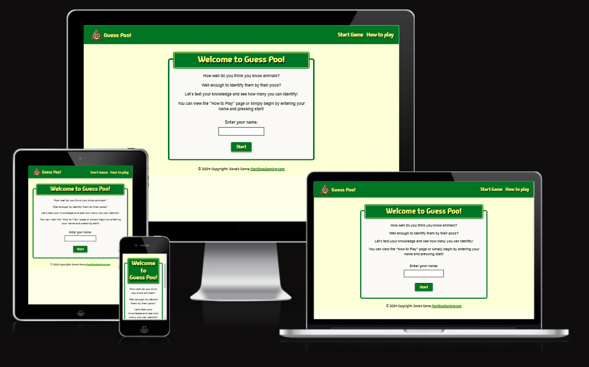

Visit the deployed site: [My Online Portfolio](https://david-walters.github.io/Milestone-2-Code-Institute/)

I have created an interesting quiz game with images to demonstrate my ability with JavaScript.


## CONTENTS

- [User Experience](#user-experience-ux)

  - [User Stories](#user-stories)

- [Design](#design)

  - [Colour Scheme](#colour-scheme)
  - [Typography](#typography)
  - [Imagery](#imagery)
  - [Wireframes](#wireframes)
  - [Features](#features)
    - [How To Play Page](#how-to-play-page)
    - [Start Game Page](#start-game-page)
    - [The Question Container](#the-question-container)
    - [Results Page](#results-page)
    - [Future Implementations](#future-implementations)
  - [Accessibility](#accessibility)

- [Technologies Used](#technologies-used)

- [Deployment & Local Development](#deployment-&-local-development)

  - [Deployment](#deployment)
  - [Local Development](#local-development)
    - [How to Fork](#how-to-fork)
    - [How to Clone](#how-to-clone)

- [Testing](#testing)
  - [Solved Bugs](#solved-bugs)
- [Credits](#credits)
  - [Code Used](#code-used)
  - [Personal Overview](#personal-overview)

---


## User Experience (UX)

### User Stories

#### First Time Visitor Goals

- I want to have a fun challenge.
- I want to see if I'm smart enough to get all the answers correct.
- I want the site to be responsive to my device.
- I want the site to be straight forward to play quickly.

#### Returning Visitor Goals

- I want to see if I can remember the correct answers.
- I want to see if my friends can beat my first-time score.

---

## Design

### Colour Scheme

A colour scheme that best suits a game that has many animals, I believe, would be greens and yellows. Greens for forest and jungle animals and yellows for safari and desert animals. I thought this would be an ideal colour scheme for my game.

I used CSS colour variables to make accessing the colours easier throughout the building process so I can easily change them until I came to a final decision on what colours I wanted. The two colour variables were coded like so:

```css
:root {
  --theme-color1: #007524;
  --theme-color2: #fbff7d;
}
```

- I have used `#000000` for the main texts that users are required to read.
- I have used `#007524` (theme color 1) for the background colour the header, headings, and buttons.
- I have used `#fbff7d` (theme color 2) for the text of the nav items, headings and buttons.
- I have used `#faf9f6` for the background colours of the containers that hold the main content.
- I have used `#fbfdc5` for the background colour of the main body of the HTML documents.

  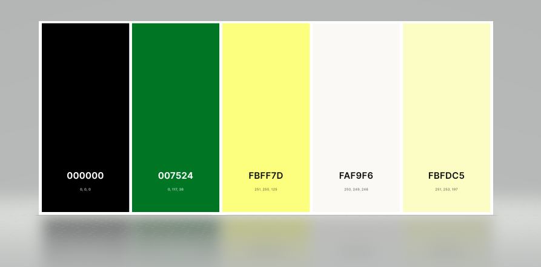

### Typography

Google Fonts was used to import the Madimi |One font for this site.

- For the nav elements, game title, headings, footer, and button text, I used the google font [Madimi One](https://fonts.google.com/specimen/Madimi+One?preview.text=Welcome%20to%20my%20Quiz%20Game!&query=madimi).

Madimi One is a typeface designed by Jeremy Mickel for Google Fonts. It belongs to the serif category and has a modern, geometric style. The font features clean lines, rounded corners, and a balanced appearance, making it suitable for various design projects, including web design, print materials, and branding.

One of the notable characteristics of Madimi One is its legibility, even at smaller sizes, which makes it versatile for both headlines and body text. Its contemporary aesthetic and subtle details contribute to its overall appeal.

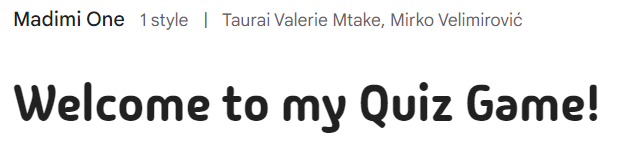

For the rest of the text on the site, I used the CSS font-family sans-serif font that every browser should be compatible with. This CSS rule tells the browser to use the default sans-serif font available on the user's system. If Arial is available, it will be used; otherwise, the browser will use another sans-serif font available on the system.

Sans-serif fonts are characterized by their lack of serifs, which are the small decorative strokes or tails found at the ends of characters in serif fonts. The absence of these serifs gives sans-serif fonts a clean and modern appearance and are easy to read.

### Imagery

I have used images found on the internet that are licence free and available to the public. The images are of a poo of an animal in particular. When the user selects an answer to suggest which animal it belongs to, an image of the animal will then be displayed.

### Wireframes

Wireframes were created using Figma.

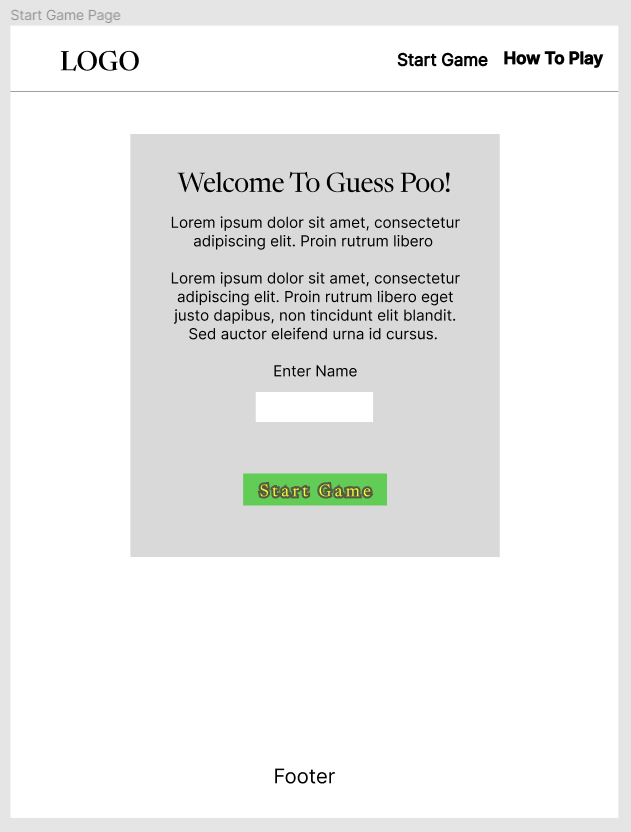

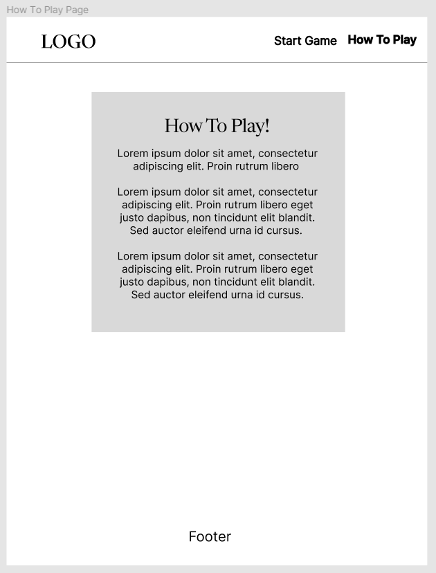

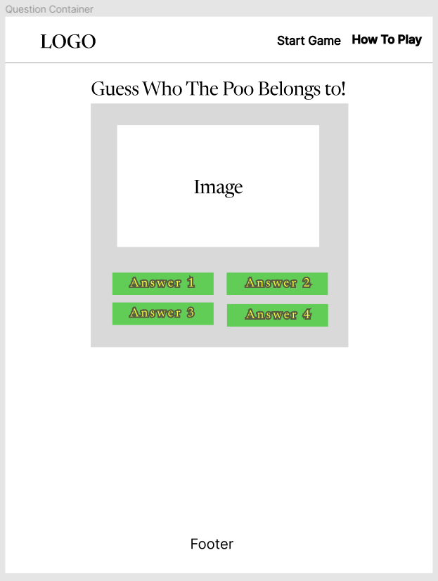

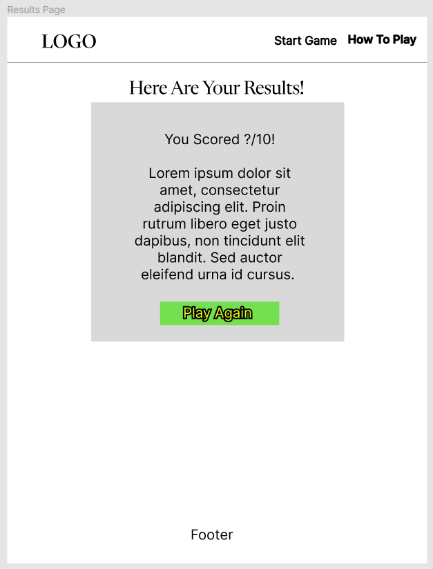

### Features

The website is comprised of a home page, an about me page, a contact page, and a portfolio page.

All Pages on the website are responsive and have:

- A favicon in the browser tab.

  

- A logo in the top left. This logo also acts as a link back to the home page or a refresh button in case there were any issues.

  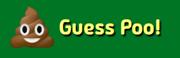

- A simple footer with a null link just for display purposes.

  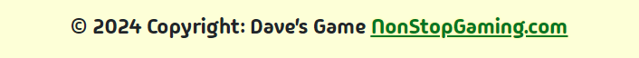

#### How To Play Page

The How To Play page literally explains to the user how to play. It states that image of an animal poo will show and the user has to select one of the foor answers. There are ten to do in total.

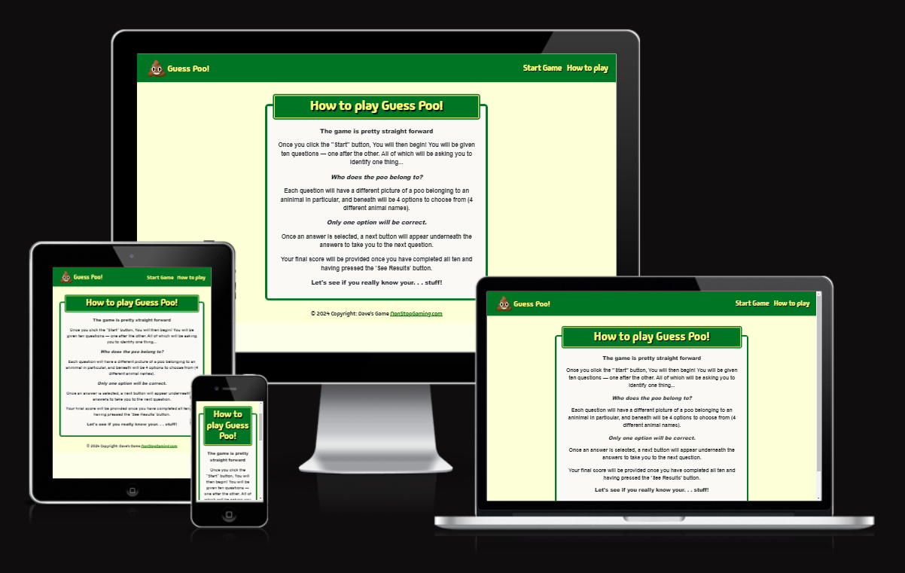

#### Start Game Page

The Start Game Page introduces the game and asks for the player's name to be typed into the text input field. The text input field will not take any numbers or special characters or more than 20 characters; else, a warning message will be displayed: "_ Min 20 characters (No numbers or special characters)", and if it is left blank with just white space, another warning message will be displayed: "_ Please enter your name"


### Question Container

Once the user starts the game, the first question will appear and it looks like so:

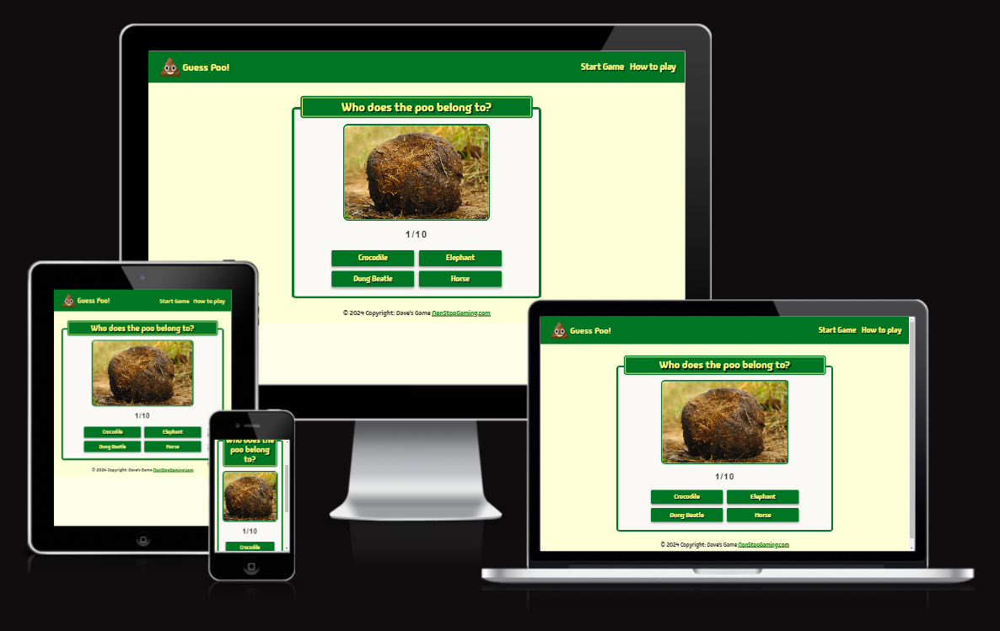

### Results Page

Once the final question has been answered, instead of a Next button being revealed, a See Result button will be revealed. This will display to the user their score out of ten and will provide a conditional comment based on their result. Here is an example:

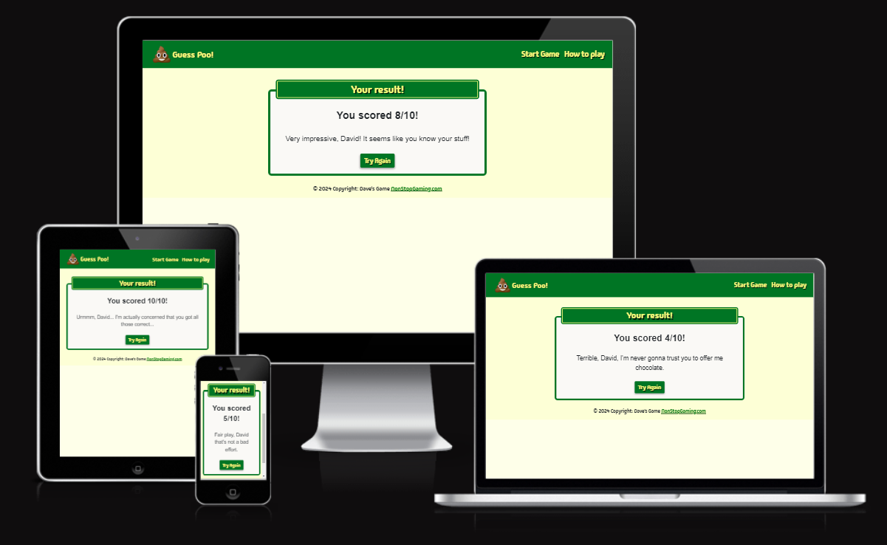

#### Future Implementations

In future implementations I would like to:

1. Add more more images to the game.
2. Make questions and answer buttons appear in a random order.
3. Have a bank of questions that randomly have ten chosen from them eavh time it is played.

### Accessibility

I have been mindful during coding to ensure that the website is as accessible friendly as possible. This has been achieved by:

- Using semantic HTML.
- Using a hover state on all buttons and links on the site to make it clear to the user if they are hovering over a button.
- Choosing a sans serif type font for the site - these fonts are suitable for people with dyslexia.
- Ensuring that there is a sufficient colour contrast throughout the site.
- Ensuring that all nav links and buttons are keyboard focusable.

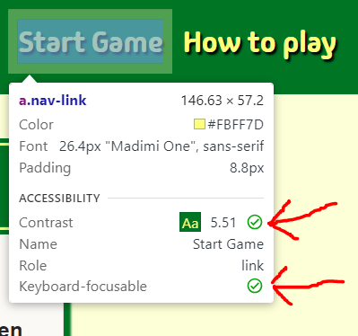 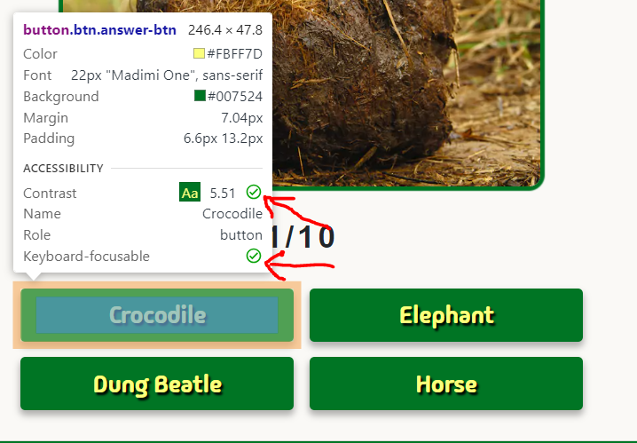

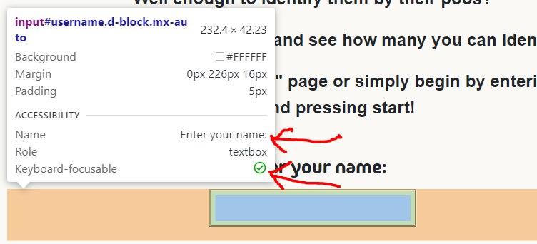

For the name input field, I used the `label` tag with the `for` attribute. This makes it easier for users, especially those with motor impairments or those who might have difficulty clicking on small targets, to interact with the input field. All buttons are fairly large which helps serve the same purpose.

```html
<form class="m-0">
  <label for="username" class="mt-3">Enter your name:</label>
  <input
    name="username"
    id="username"
    type="text"
    class="d-block mx-auto"
    required
  />
  <button type="submit" class="btn my-3 px-4">Start</button>
</form>
```

---

## Technologies Used

- [**HTML5**](https://developer.mozilla.org/en-US/docs/Web/Guide/HTML/HTML5)
  - The project uses **HTML5** to create the basic elements and content of my website.
- [**CSS3**](https://developer.mozilla.org/en-US/docs/Web/CSS/CSS3)
  - The project uses **CSS3** to add custom styles to the elements and content of my website.
- [**Bootstrap v4.6.2**](https://getbootstrap.com/)
  - The project uses **Bootstrap v4.6.2** to add a responsive grid system, prebuilt components, plugins built on jQuery, and Bootstrap styles to my website, before adding my custom styles.
- [**jQuery**](https://jquery.com)
  - The project uses **jQuery** to simplify DOM manipulation. This is the standard jQuery that is built with Bootstrap components.
- [**JavaScript**](https://www.javascript.com/)
  - The project uses **JavaScript** from Bootstrap which is required to add functionality to some of Bootstrap's components.
- [**Figma Wireframes**](https://www.figma.com/)
  - Using **Figma Wireframes** is very beneficial to guage what you will add and where you will put them on your pages, and it gives you a good visual to see if you missed anything or should add anything.
- [**Font Awesome**](https://fontawesome.com/)
  - The project uses **Font Awesome** for the social media links and various other icons for several headers and titles in my website.
- [**Google Fonts**](https://fonts.google.com/)
  - Having access to **Google Fonts** helped enhance the typography and design of my website by easily integrating and customizing high-quality fonts, thereby improving readability and visual appeal.
- [**Visual Studio Code**](https://code.visualstudio.com/)
  - I've used **Visual Studio Code** as the development environment to write the code for my website.
- [**Git**](https://git-scm.com/)
  - I've used **Git** as a version control system to regularly add and commit changes made to project in Cloud9, before pushing them to GitHub.
- [**GitHub**](https://github.com/)
  - I've used **GitHub** as a remote repository to push and store the committed changes to my project from Git. I've also used GitHub pages to deploy my website in a live environment.
- [**Chrome DevTools**](https://developer.chrome.com/docs/devtools/)
  - I've used **Chrome DevTools** to view my website from different screen sizes and to play around with the HTML and CSS before deciding what code to implement.
- [**Lighthouse**](https://developers.google.com/web/tools/lighthouse)
  - I utilised **Lighthouse** to conduct comprehensive tests on my website, examining performance, accessibility, best practices, and SEO. It generates detailed reports and optimization suggestions to enhance overall website quality and user experience.
- [**W3C Markup Validation**](https://validator.w3.org/)
  - Through using **W3C Markup Validation**, I had conformity to W3C standards for HTML and CSS. I've utilized this tool to verify and rectify HTML issues, ensuring improved cross-browser compatibility and adherence to web standards.
- [**Am I Responsive?**](http://ami.responsivedesign.is/)
  - Through using **Am I Responvive**, I was able to produce the images you have seen in this readme file of the website being displayed on all screen sizes.

---

## Deployment & Local Development

### Deployment

The hosting platform that I've used for my project is GitHub Pages. To deploy my website to GitHub pages, I used the following steps:

1. Press `ctrl+'` in VS Code which opens the integrated terminal in the root directory of the project folder.
2. Initialise Git using the `git init` command.
3. Add all files to the staging area using the `git add .` command.
4. Commit the files using the `git commit -m "First commit"` command.
5. Create a new repository in GitHub called 'Milestone-1'.
6. Copy the code withe the origin that GitHub provides and paste into the terminal window:

   ```
   git remote add origin https://https://github.com/david-walters/Milestone-2-Code-Institute.git

   git push -u origin main

   ```

7. Go into 'Settings' on my repository page in GitHub.
8. Select the 'main branch' option under the 'GitHub Pages' section and then pressed 'save'.
9. Open the provided link to the website in a new tab.

### Local Development

#### How to Fork

To fork the repository:

1. Log in (or sign up) to Github.
2. Go to the repository for this project, [david-walters/Milestone-2-Code-Institute](https://github.com/david-walters/Milestone-2-Code-Institute)
3. Click the Fork button in the top right corner.

#### How to Clone

To clone the repository:

1. Log in (or sign up) to GitHub.
2. Go to the repository for this project, [david-walters/Milestone-1-Code-Institute](https://github.com/david-walters/Milestone-2-Code-Institute)
3. Click on the code button, select whether you would like to clone with HTTPS, SSH or GitHub CLI and copy the link shown.
4. Open the terminal in your code editor and change the current working directory to the location you want to use for the cloned directory.
5. Type 'git clone' into the terminal and then paste the link you copied in step 3. Press enter.

---

## Testing

Please refer to [TESTING.md](TESTING.md) file for all testing carried out.

### Solved Bugs

| No  | Bug                                                                                                                                                                                                                                                                                                                                                          | How I solved the issue                                                                                                                                                                                                                                                                                                                                           |
| :-- | :----------------------------------------------------------------------------------------------------------------------------------------------------------------------------------------------------------------------------------------------------------------------------------------------------------------------------------------------------------- | :--------------------------------------------------------------------------------------------------------------------------------------------------------------------------------------------------------------------------------------------------------------------------------------------------------------------------------------------------------------- |
| 1   | When I attempted to use JS to display the quiz images by changing the CSS background image URL, it failed. I checked the file path and it seemed ok but nothing was showing                                                                                                                                                                                  | I discovered that despite chanching the file path through the CSS file using JS, the JS required me to put the file path relative to the HTML document instead — problem solved.                                                                                                                                                                                 |
| 2   | The console kept revealing an error when the See Results button was selected because it would increment the question index if the following condition is true `if (currentQuestionIndex < questions.length).`. The last index is 9 and the length is 10. The console was showing an error as the condition is still met and there's no index 10 in the array | This didn't cause the game to malfunction but I still wanted to solve the issue. It was simply solved by adding +1 to the code like so: ` if (currentQuestionIndex + 1 < questions.length`. This made the condition false after the previous question was answered and thus prevented the incrementing of the questionIndex after the final question is answered |

---

## Credits

### Code Used

I have been using Bootstrap's libraries and have referred to the Bootstrap website to see how to utilise the libraries.

I have learned how to code a header with nav elements which will collapse into a button which, when pressed, creates a dropdown field revealing the nav items.

### Personal Overview

From the beginning to the end of this assignment, it has been an enjoyable process for me. I came across many hurdles in the past when working with JS, but this time, after learning more, I found the project very easy and was very happy to finally understand the main concepts regarding JS :joy:

It has been a great experience and I'm looking forward to working on my other project assignments which I shall be uploading to my portfolio for people to see.

Thanks for checking this out!

:+1:
