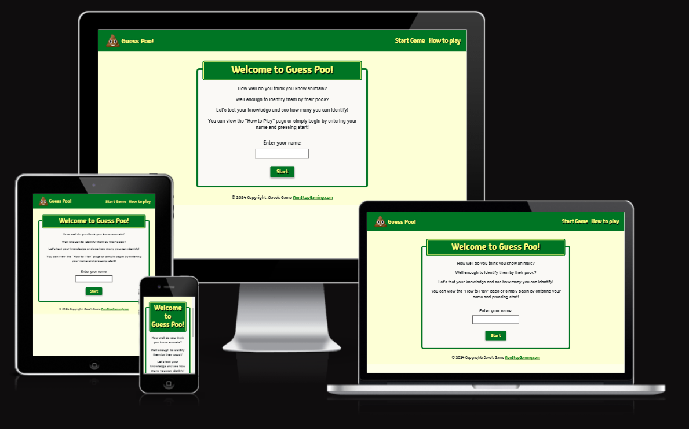

# My JS Quiz: Guess Poo! — Testing

Visit the deployed site: [My JS Quiz: Guess Poo!](https://david-walters.github.io/Milestone-2-Code-Institute/)

---

## CONTENTS

- [AUTOMATED TESTING](#automated-testing)
  - [W3C Validator](#w3c-validator)
  - [Lighthouse](#lighthouse)
- [MANUAL TESTING](#manual-testing)
  - [Testing User Stories](#testing-user-stories)
  - [Full Testing](#full-testing)

Testing was ongoing throughout the entire build of this project. During development I made use of google developer tools to ensure everything was working correctly and to assist with troubleshooting when things were not working as expected.

I have gone through each page using google chrome developer tools & Firefox inspector tool to ensure that each page is responsive on a variety of different screen sizes and devices and to ensure that the keyframes also work on different browsers.

---

## AUTOMATED TESTING

### W3C Validator

[W3C](https://validator.w3.org/) was used to validate the HTML on both pages of the website. It was also used to validate the CSS.

- [index.html](assets/images/test-images/w3-index.png) - Passed/No-errors.
- [how-to-play.html](assets/images/test-images/w3-how-to-play.png) - Passed/No-errors
- [styles.css](assets/images/test-images/w3-css.png) - Passed/No-errors

The script.js file was also tested on numerous validators and each validator had it's own opinion on recommended fixes but no major issues were found. One validator said that I should have used double quotes in so many places, but single quotes are completely fine and they do not effect the code any differently. Google dev tools shows no errors at all.

---

### Lighthouse

I used Lighthouse within the Chrome Developer Tools to test the performance, accessibility, best practices and SEO of the website.

### Desktop Results

Both pages of the site are achieving a score of 100 for accessibility, performance, best practices, and SEO — Perfect results.

### Mobile Results

Each page is achieving a score of 100 for the last three categories. The performance category is achieving a score of 98 for the first three pages and a score of 99 on the 404 & 500 page.

---

## MANUAL TESTING

### Testing User Stories

`First Time Visitors`

| Goals                                                             | How are they achieved?                                                                                                                                                                     |
| :---------------------------------------------------------------- | :----------------------------------------------------------------------------------------------------------------------------------------------------------------------------------------- |
| I want to have a fun challenge.                                   | My Quiz Game is funny, and it makes you have to think and study the images and answers to get it correct                                                                                   |
| I want to see if I'm smart enough to get all the answers correct. | This game requires you to be intellegent through investigating the images and identifying clues. Everytime the user selects an answer, they will be informed whether it was correct or not |
| I want the site to be responsive to my device.                    | The site was built using Bootstrap, which is a CSS library for making responsive websites — starting from mobile first                                                                     |
| I want the site to be straight forward to play quickly.           | The site instantly loads with the name input field and the start button to begin the game straight away                                                                                    |

`Returning Visitors`

| Goals                                                     | How are they achieved?                                                                                                                                         |
| :-------------------------------------------------------- | :------------------------------------------------------------------------------------------------------------------------------------------------------------- |
| I want to see if I can remember the correct answers.      | The game is playable as many times as one likes                                                                                                                |
| I want to see if my friends can beat my first-time score. | Friends of mine played the game and took screen shots of their scores and put them up on a whatsapp group. The URL can be shared so others can send to friends |

---

### Full Testing

Full testing was performed on the following devices and more on Google dev tools:

The site was tested using the following browsers:

- Google Chrome
- Microsoft IE
- Firefox

Additional testing was taken by friends and family on a variety of devices and screen sizes. They reported no issues when visiting and navigating.

`Start Game Page`

| Feature                   | Expected Outcome                                                                                                              | Testing Performed                                                                                                    | Result                                                                                       | Pass/Fail |
| ------------------------- | ----------------------------------------------------------------------------------------------------------------------------- | -------------------------------------------------------------------------------------------------------------------- | -------------------------------------------------------------------------------------------- | --------- |
| The site's Logo           | The logo should refresh the page                                                                                              | Clicked the logo                                                                                                     | The page refreshes                                                                           | Pass      |
| Nav item - Start Game     | Link should be nullified                                                                                                      | Clicked on the nav item                                                                                              | Behaves as a nullified link                                                                  | Pass      |
| Nav item - How to play    | Link directs the user to the How To Play page                                                                                 | Clicked on the nav item                                                                                              | How To Play page loads                                                                       | Pass      |
| Nav items' hover state    | The scale increases and colour becomes more vibrant except for the active class link                                          | Hovered over the nav items                                                                                           | The scale increases and colour becomes more vibrant except for the active class link         | Pass      |
| Name input field warnings | User should be warned if no name is typed, more than 20 characters are entered, or if any number or special character is used | I tried starting the game with no name, using more than 20 characters, using a number, and using a special character | The warning message appears for each incident                                                | Pass      |
| Start button              | Begins the quiz (quiz/game container displays and the inital start game container is hidden)                                  | Clicked on the button                                                                                                | The quiz begins (quiz/game container displays and the inital start game container is hidden) | Pass      |

`Quiz/Game Container`

| Feature                          | Expected Outcome                                                                                                                                                                                                | Testing Performed                                                                    | Result                                                                                                                                                                                                                                       | Pass/Fail |
| -------------------------------- | --------------------------------------------------------------------------------------------------------------------------------------------------------------------------------------------------------------- | ------------------------------------------------------------------------------------ | -------------------------------------------------------------------------------------------------------------------------------------------------------------------------------------------------------------------------------------------- | --------- |
| Correct answers being selected   | The correct answer highlights green and the incorrect answers highlight red. The question image changes to the answer image. The heading changes to green and says "Correct!" and the score is incremented by 1 | Clicked the correct answer                                                           | The correct answer highlights green and the incorrect answers highlight red. The question image chancges to the answer image. The heading changes to green and says "Correct!" and the score is incremented by 1 and the Next button appears | Pass      |
| Incorrect answers being selected | The correct answer highlights green and the incorrect answers highlight red. The question image changes to the answer image. The heading changes to red and says "Wrong!" and the Next button appears           | Clicked on the incorrect answers                                                     | The correct answer highlights green and the incorrect answers highlight red. The question image changes to the answer image. The heading changes to red and says "Wrong!" and the Next button appears                                        | Pass      |
| Next button                      | All changes made after answering the questions should revert back to the original status and the next quiz image should show                                                                                    | Clicked on the Next button                                                           | All changes made after answering the questions reverted back to the original status and the next quiz image then showed                                                                                                                      | Pass      |
| See Results button               | Question container should get hidden, results container should get revealed. Score out of ten should be show along with the relative comment for the score. page                                                | Clicked on the See results button after playing several times with a different score | Question container gets hidden, results container gets revealed. Score out of ten shows correctly along with the relative comment for each score earned.                                                                                     | Pass      |

`Results Container`

| Feature          | Expected Outcome                                                                                                    | Testing Performed            | Result                                                                                                      | Pass/Fail |
| ---------------- | ------------------------------------------------------------------------------------------------------------------- | ---------------------------- | ----------------------------------------------------------------------------------------------------------- | --------- |
| Try Again button | The quiz game should begin again with all previous changes reverted to the original status that the user began with | Clicked the Try Again button | The quiz game starts again with everything back to the original status when the user first started the game | Pass      |

`How To Play Page`

| Feature                | Expected Outcome                                                                     | Testing Performed          | Result                                                                               | Pass/Fail |
| ---------------------- | ------------------------------------------------------------------------------------ | -------------------------- | ------------------------------------------------------------------------------------ | --------- |
| The site's Logo        | The logo should load the index page (Start Game page)                                | Clicked the logo           | The Start Game page loads                                                            | Pass      |
| Nav item - How to play | Link should be nullified                                                             | Clicked on the nav item    | Behaves as a nullified link                                                          | Pass      |
| Nav item - Start game  | Link directs the user to the Start Game page                                         | Clicked on the nav item    | Start Game page loads                                                                | Pass      |
| Nav items' hover state | The scale increases and colour becomes more vibrant except for the active class link | Hovered over the nav items | The scale increases and colour becomes more vibrant except for the active class link | Pass      |
